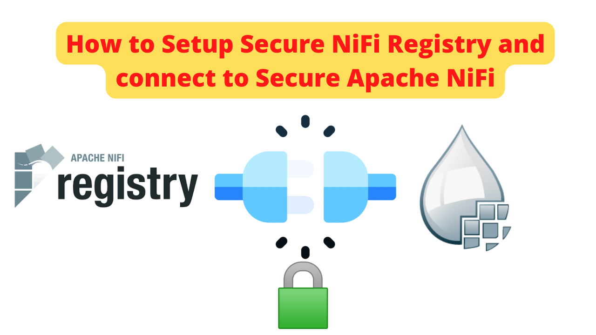

# How to Setup Secure NiFi Registry and connect to Secure Apache NiFi


How to Setup Secure NiFi Registry and connect to Secure Apache NiFi




#### 💬 If you have Questions or wanna have a chat - Join Me on Discord at:
[Apache NiFi Topics Q&A](https://discord.gg/qymAvnZqmQ)

[Data Engineering Topics Q&A](https://discord.gg/YykpUT5Wt2)

[Data Engineering  Compass Q&A](https://discord.gg/XR3JqUrA74)


##### Find the video version of this article at [How to Setup Secure NiFi Registry and connect to Secure Apache NiFi](https://youtu.be/j-JXo3xPxOk)

#### Make sure you have Download NiFi Registry and unziped it. 
 I have placed my NiFi Registry installation in `/opt/nifi-registry`


#### Edit nifi-registry.properties file from conf directory 
**Note** - we will use the certificates we have generated in this tutorial [Apache NiFi Secure Standalone Setup](https://github.com/InsightByte/ApacheNifi/tree/main/NiFi-Secured-Single-Instance)
```
 <!-- remove port -->
nifi.registry.web.http.port=
 <!-- add port -->
nifi.registry.web.https.host=localhost
nifi.registry.web.https.port=19443


 <!-- add security info -->
nifi.registry.security.keystore=/opt/nifi-prd-3/certs/localhost/keystore.jks
nifi.registry.security.keystoreType=jks
nifi.registry.security.keystorePasswd=FQTXPIbcXHPG8PgJNzmDC5gbcMo0WtxMscX+5B1adUY
nifi.registry.security.keyPasswd=FQTXPIbcXHPG8PgJNzmDC5gbcMo0WtxMscX+5B1adUY
nifi.registry.security.truststore=/opt/nifi-prd-3/certs/localhost/truststore.jks
nifi.registry.security.truststoreType=jks
nifi.registry.security.truststorePasswd=5SqAT2xZcGdOMnJhvmTg5K+ttY7F/HA2XCpO+rJzaTo
```

#### Edit authorizers.xml file in your conf directory
```
    <userGroupProvider>
            <identifier>file-user-group-provider</identifier>
            <class>org.apache.nifi.registry.security.authorization.file.FileUserGroupProvider</class>
            <property name="Users File">./conf/users.xml</property>
            <property name="Initial User Identity 1">CN=InsightByte, OU=DEMO</property>
        </userGroupProvider>
    <userGroupProvider>
            <identifier>database-user-group-provider</identifier>
            <class>org.apache.nifi.registry.security.authorization.database.DatabaseUserGroupProvider</class>
            <property name="Initial User Identity 1">CN=InsightByte, OU=DEMO</property>
        </userGroupProvider>
    <userGroupProvider>
        <identifier>composite-configurable-user-group-provider</identifier>
        <class>org.apache.nifi.registry.security.authorization.CompositeConfigurableUserGroupProvider</class>
        <property name="Configurable User Group Provider">file-user-group-provider</property>
        <property name="User Group Provider 1">CN=InsightByte, OU=DEMO</property>
    </userGroupProvider>
   <accessPolicyProvider>
        <identifier>file-access-policy-provider</identifier>
        <class>org.apache.nifi.registry.security.authorization.file.FileAccessPolicyProvider</class>
        <property name="User Group Provider">file-user-group-provider</property>
        <property name="Authorizations File">./conf/authorizations.xml</property>
        <property name="Initial Admin Identity">CN=InsightByte, OU=DEMO</property>
        <property name="NiFi Group Name"></property>
        <property name="NiFi Identity 1">CN=InsightByte, OU=DEMO</property>
    </accessPolicyProvider>
    <accessPolicyProvider>
        <identifier>database-access-policy-provider</identifier>
        <class>org.apache.nifi.registry.security.authorization.database.DatabaseAccessPolicyProvider</class>
        <property name="User Group Provider">database-user-group-provider</property>
        <property name="Initial Admin Identity">CN=InsightByte, OU=DEMO</property>
        <property name="NiFi Identity 1">CN=InsightByte, OU=DEMO</property>
        <property name="NiFi Group Name"></property>
    </accessPolicyProvider>
```

#### Start your Registry 
```
/opt/nifi-registry/bin/nifi-registry.sh start
```


#### Using the UI add a new user with the name `CN=localhost, OU=NIFI` and grant him `Bucket Read/Write` and `Can proxy user requests Read/Write`


#### In thr NiFi UI, we need to grant the user `CN=localhost, OU=NIFI` access to the policy `retrieve site-to-site details` and `view the user interface`


#### Now you should be able to Securely use the NiFi Registry from a Secured NiFi Instance.
